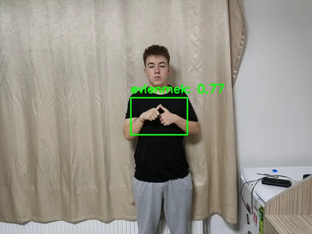

# Turkish Sign Language Recognition

## Project Overview

This repository implements a sign-language recognition system for Turkish Sign Language (TSL). The project contains code for dataset handling, training a detection/recognition model, running realtime inference, and utilities for preparing and evaluating data. The model checkpoints and example dataset organization are included to help reproduce results or continue research.

## Key Components

- `SignDETR_Colab_Complete.py` — Main training/experiment script (colab-friendly entrypoint).
- `test.py` — Scripts for running tests / offline inference.
- `realtime.py` — Realtime inference / demo script to run the model on a webcam or live feed.
- `src/` — Core source code: dataset loaders, loss functions, training loop and helpers.
- `utils/` — Utility scripts for data collection, logging, and evaluation helpers.
- `checkpoints/` — Saved model weights. Example: `best.pt` (highest validation performance snapshot).
- `data/` — Example dataset layout (train / test split with `images/` and `labels/`).

## Repository Structure

- README.md — this file
- SignDETR_Colab_Complete.py — training/experiment orchestration
- config.json — configuration used by training scripts
- src/ — implementation modules (`data.py`, `loss.py`, `realtime.py`, `test.py`)
- utils/ — helper scripts (`boxes.py`, `collect_images.py`, etc.)
- checkpoints/ — model weights
- data/ — example dataset (organized by `train` and `test`, each with `images/` and `labels/`)

## Dataset Format

Place your dataset under the `data/` directory with the following recommended structure:

```
data/
	train/
		images/
		labels/
	test/
		images/
		labels/
```

Label files are plain text files in the `labels/` folders paired with images in `images/`. The training scripts expect the same label format used in the repository (see `src/data.py` for exact parsing rules). If you have a custom annotation format, adapt `src/data.py` or the dataset loader before training.

## Requirements

Install the usual Python machine-learning stack. Example (create a virtualenv first):

```bash
python -m venv venv
venv\Scripts\activate
pip install -U pip
pip install torch torchvision opencv-python numpy matplotlib pyyaml tqdm
```

Note: Exact versions of `torch` and other libraries depend on your CUDA / platform. If you use CPU-only, install the CPU variants of `torch`.

## Quickstart — Training

1. Prepare dataset under `data/` as described above.
2. Review and edit `config.json` to set model, training, and dataset hyperparameters.
3. Start training (example):

```bash
python SignDETR_Colab_Complete.py --config config.json
```

The script will read the dataset and configuration, train the model, and save checkpoints in `checkpoints/`.

## Quickstart — Evaluation & Inference

- To run offline evaluation or inference on images, use `test.py` (inspect the script for CLI options):

```bash
python test.py --weights checkpoints/best.pt --data data/test
```

- For realtime webcam inference, run:

```bash
python realtime.py --weights checkpoints/best.pt
```

Adjust flags and arguments by opening each script header or `config.json`.

## Example



```

## Tips & Notes

- If you see mismatched label parsing errors, open `src/data.py` to confirm the expected label format and adapt your annotations accordingly.
- Use smaller batch sizes if you run out of GPU memory.
- The repository contains helper scripts in `utils/` for collecting images, visualizing predictions, and logging progress.

## Checkpoints

Pretrained or example weights are stored in `checkpoints/` (example: `best.pt`). Use these for quick evaluation or as initialization for fine-tuning.

## Contributing

Contributions, bug reports, and improvements are welcome. Open an issue or submit a pull request with brief description and reproduction steps.

## License & Contact

This repository does not include an explicit license file. If you plan to reuse or redistribute the code, please add a `LICENSE` file or contact the repository owner for permission and licensing details.

For questions, reach out in the repository issues or contact the author listed in project metadata.


